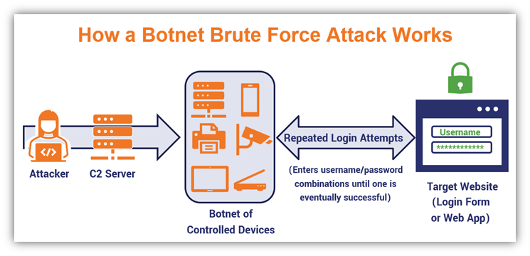

# Отчет по индивидуальному кафедральному заданию
**Формулировка:** "Способ повышения защищенности OC Linux"

**Задачи:**
- Сбор и систематизация базовой информации об ОС Linux
- Анализ сильных и слабых сторон Linux
- Исследование типовых угроз для Linux
- Разработка рекомендаций по защите Linux
  
---

## Ход работы:

### 1. Сбор и систематизация базовой информации об ОС Linux

- Была изучена история создания и развития Linux, его основные дистрибутивы (Ubuntu, Debian, CentOS)
- Проведён анализ архитектуры системы: ядро, оболочка, файловая структура
- Рассмотрены принципы работы с пользователями и правами доступа

### 2. Анализ сильных и слабых сторон Linux

- Были выявлены ключевые преимущества: открытый исходный код, стабильность, безопасность
- Определены недостатки: сложность для новичков, проблемы с поддержкой оборудования
- Проведён анализ уязвимостей в популярных дистрибутивах за последние 3 года

### 3. Исследование типовых угроз для Linux

- Были изучены распространённые атаки: bruteforce, DDoS, эксплуатация уязвимостей

   
  
- Рассмотрены риски, связанные с неправильной настройкой сервисов

### 4. Разработка рекомендаций по защите Linux

- Изучены и разработаны рекомендации по защите OC Linux такие как:

#### 4.1 Внедрение строгих требований к паролям (сложность, регулярная смена)

Обязательное использование надежных паролей с заданным уровнем сложности, а также их периодическая смена снижают риски взлома учетных записей. Это является важной частью политики контроля доступа и аутентификации.

#### 4.2 Обязательное использование SSH-ключей вместо парольного входа

Для повышения безопасности удаленного доступа рекомендуется внедрение SSH-ключей, что исключает риски, связанные с перехватом паролей. Это обеспечивает более надежную аутентификацию и снижает вероятность несанкционированного доступа.

#### 4.3 Настройка двухфакторной аутентификации для критичных аккаунтов

Для критически важных учетных записей необходимо применять двухфакторную аутентификацию, что добавляет дополнительный уровень защиты и усложняет компрометацию учетных данных.

#### 4.4 Запрет прямого доступа root с обязательным использованием sudo

Использование команды sudo предпочтительнее прямого доступа к учетной записи root, так как это ограничивает привилегированный доступ и позволяет вести журнал выполняемых команд, повышая подотчетность.

#### 4.5 Автоматическая блокировка учетных записей после множества неудачных попыток входа

Внедрение механизмов автоматической блокировки учетных записей после нескольких неудачных попыток входа предотвращает атаки методом перебора (brute force) и снижает риски несанкционированного доступа.

#### 4.6 Регулярный аудит и очистка неактивных пользовательских учетных записей

Регулярная деактивация неиспользуемых учетных записей минимизирует потенциальные векторы атак, так как такие аккаунты могут стать уязвимыми из-за отсутствия контроля и обновлений.

---

## Итог

Проведенная работа была направлена на комплексное исследование безопасности операционной системы Linux с целью выработки эффективных мер защиты. В ходе выполнения поставленных задач был собран и систематизирован базовый объем информации о Linux, включая ее архитектуру, механизмы управления доступом и особенности функционирования. Это позволило сформировать четкое понимание ключевых аспектов, влияющих на защищенность системы.

Анализ сильных и слабых сторон Linux подтвердил ее надежность и гибкость, однако выявил и уязвимости, связанные с неправильной настройкой, устаревшим ПО и недостаточным контролем доступа. Исследование типовых угроз, таких как атаки методом перебора, эксплуатация непатченных уязвимостей и несанкционированный доступ, позволило определить наиболее критичные векторы атак, требующие повышенного внимания.

На основе проведенного анализа были разработаны практические рекомендации по усилению безопасности Linux-систем, включающие:

- Ужесточение политик аутентификации (использование SSH-ключей, двухфакторной аутентификации, сложных паролей);
- Ограничение привилегированного доступа (запрет прямого входа под root, применение sudo);
- Автоматизацию защиты от атак (блокировка учетных записей после множества неудачных попыток входа);
- Регулярный аудит системы (мониторинг активности, очистка неиспользуемых учетных записей).

Реализация предложенных мер позволит значительно повысить уровень защищенности Linux-инфраструктуры, минимизировать риски кибератак и обеспечить стабильную работу системы в долгосрочной перспективе. Дальнейшее развитие данного направления может включать углубленное изучение современных средств мониторинга и автоматизированного реагирования на инциденты безопасности.

  
